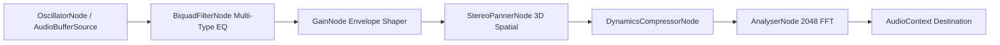

# Nexus Media Engine — Architecture Specification

## 1. Audio Processing Graph
Built on native Web Audio API nodes with 32-bit floating point precision at 48 kHz.

## 2. FFT Spectral Analyzer Formula
Frequency bin resolution: $\Delta f = \frac{f_s}{N} = \frac{48000}{2048} \approx 23.44\text{ Hz/bin}$.
