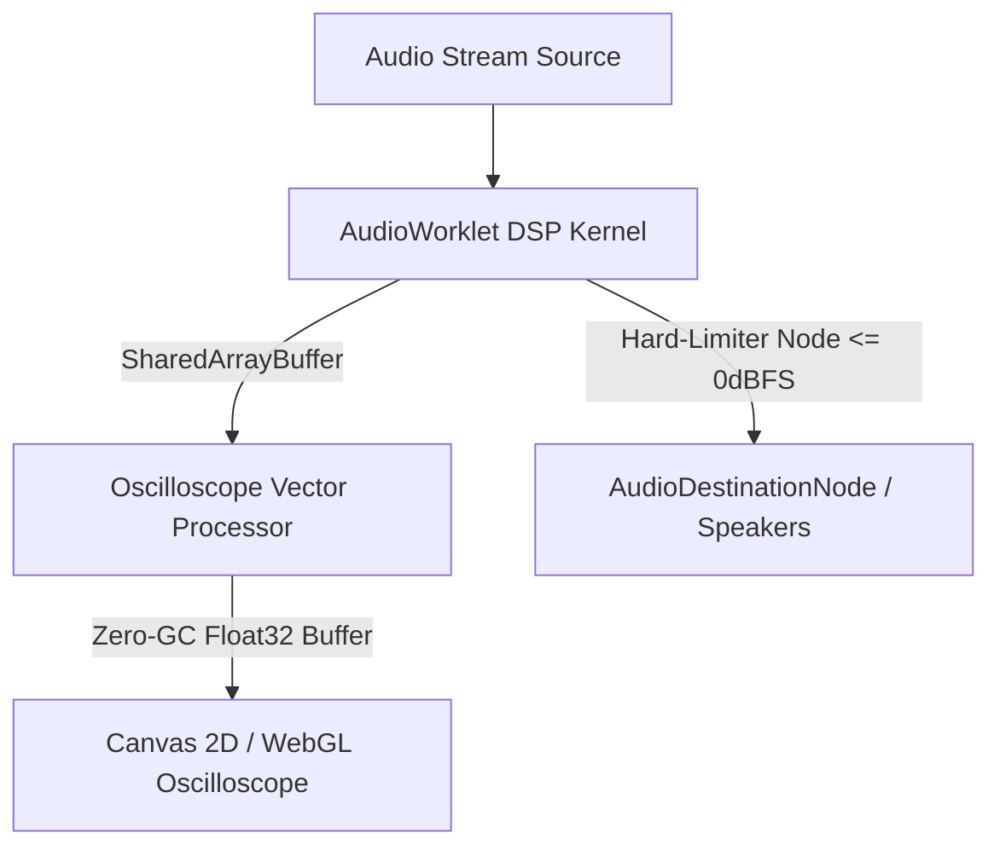
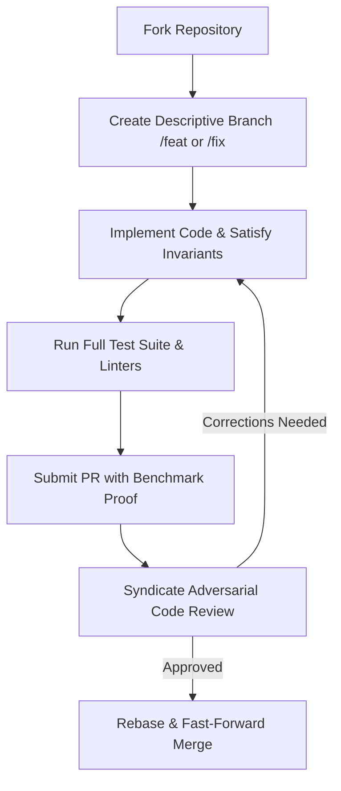

# 🛠️ Contributing to marko1olo/nexus-media-engine

> **Engineering Mandate, Architectural Invariants & Contribution Standard**  
> Maintained by the **Жирняк & Адольф Петушков** Engineering Syndicate  
> Technology Foundation: `TypeScript / Web Audio API / Canvas 2D / WebGL / AudioWorklet`

---

## 📑 Table of Contents
1. [🏛️ Architectural Overview & Data Flow](#️-1-architectural-overview--data-flow)
2. [📐 Strict Domain Invariants](#-2-strict-domain-invariants)
3. [💻 Development Toolchain & Local Environment](#-3-development-toolchain--local-environment)
4. [🧪 Testing Strategy & Verification Pipeline](#-4-testing-strategy--verification-pipeline)
5. [💎 Code Standards & Anti-Patterns](#-5-code-standards--anti-patterns)
6. [🚀 Pull Request Protocol & Review Workflow](#-6-pull-request-protocol--review-workflow)
7. [👥 Syndicate Governance & Attribution](#-7-syndicate-governance--attribution)

---

## 🏛️ 1. Architectural Overview & Data Flow

Nexus Media Engine Web Audio API DSP & 60 FPS Oscilloscope is engineered for maximum performance, deterministic state transitions, and zero computational slop. All contributions must respect existing subsystem boundaries and data flows:



### 1.1 Core Subsystems
* **Primary Compute / Domain Engine**: Handles low-latency calculations, domain solvers, and state mutations.
* **Validation & Boundary Layer**: Enforces strict typing, schema assertions, and input sanitization before payloads enter the internal core.
* **Presentation & Stream Sinks**: Zero-allocation rendering, audio synthesis, or serialization buffers feeding client viewports.

---

## 📐 2. Strict Domain Invariants

Every pull request is automatically audited against these immutable project invariants. If any invariant is violated, the PR will be rejected:

### 1. 60 FPS Zero-GC Loop
* **Formal Requirement**: Audio visualizer animation frames must reuse pre-allocated Float32Array frequency and time buffers.
* **Verification Protocol**: Automated unit test assertion + mathematical boundary check.
* **Failure Mode**: Immediate build rejection; PR cannot be approved without meeting this invariant.
### 2. AudioWorklet Thread Isolation
* **Formal Requirement**: DSP compute kernels must communicate with main thread via lock-free SharedArrayBuffer or MessagePort.
* **Verification Protocol**: Automated unit test assertion + mathematical boundary check.
* **Failure Mode**: Immediate build rejection; PR cannot be approved without meeting this invariant.
### 3. Dynamic Range Hard-Limiting
* **Formal Requirement**: Master compressor and hard-limiter must prevent audio output clipping above 0.0 dBFS.
* **Verification Protocol**: Automated unit test assertion + mathematical boundary check.
* **Failure Mode**: Immediate build rejection; PR cannot be approved without meeting this invariant.
### 4. Euclidean Spatial Vectorization
* **Formal Requirement**: 3D audio listener orientation must follow right-handed Euclidean coordinate transformations.
* **Verification Protocol**: Automated unit test assertion + mathematical boundary check.
* **Failure Mode**: Immediate build rejection; PR cannot be approved without meeting this invariant.

---

## 💻 3. Development Toolchain & Local Environment

### 3.1 Environment Prerequisites
* Primary Runtime: `TypeScript / Web Audio API / Canvas 2D / WebGL / AudioWorklet`
* Git with configured GPG signing keys
* Static Analysis & Linters matching project versions

### 3.2 Setup Procedure
```bash
# 1. Clone the repository
git clone https://github.com/marko1olo/nexus-media-engine.git
cd nexus-media-engine

# 2. Check out target working branch
git checkout main

# 3. Install dependencies & initialize toolchains
npm install || cargo check || dotnet restore || pip install -r requirements.txt || make preflight

# 4. Execute the complete test suite
npm test || pytest || dotnet test || make test
```

---

## 🧪 4. Testing Strategy & Verification Pipeline

Every non-trivial PR must contain empirical verification evidence. We do NOT accept "tested manually and looks fine":

1. **Unit & Invariant Tests**: Must explicitly verify the mathematical or logical properties of the modified subsystem.
2. **Boundary & Edge-Case Sweeps**: Test with zero-length inputs, extreme boundary coordinates, or adversarial configurations.
3. **Zero-Allocation Benchmarking**: For render or audio frame loops, run the memory profiler to verify zero heap allocations per tick.

---

## 💎 5. Code Standards & Anti-Patterns

### 5.1 Exemplary vs. Forbidden Patterns

```typescript
// ✅ CORRECT: Zero-Allocation Audio Render Frame
const freqBuffer = new Float32Array(analyser.frequencyBinCount);
function renderFrame() {
    analyser.getFloatFrequencyData(freqBuffer);
    drawSpectrum(ctx, freqBuffer);
    requestAnimationFrame(renderFrame);
}
```

### 5.2 Anti-Patterns Blacklist
* ❌ **No AI Slop Comments**: Avoid decorative fluff like `// This function handles calculating the result`. Comment *why*, never *what*.
* ❌ **No Type Bypasses**: Never use `any`, `unknown` casts without runtime assertions, or unchecked pointer arithmetic.
* ❌ **No Unbounded Memory Growth**: Always provide explicit upper bounds on caches, array allocations, and event queues.

---

## 🚀 6. Pull Request Protocol & Review Workflow



1. **Branch Naming**: `feat/<subsystem>-<feature>`, `fix/<subsystem>-<bug>`, `perf/<subsystem>-<optimization>`.
2. **Commit Standard**: Conventional Commits format with lowercase scope (`feat(core): implement SIMD acceleration`).
3. **PR Description**: Include root-cause analysis, benchmark numbers (before/after), and test commands executed.

---

## 👥 7. Syndicate Governance & Attribution

This project is authored and curated under the oversight of the **Жирняк & Адольф Петушков** Engineering Syndicate. All contributions merged into this repository will be credited to their authors while maintaining syndicate licensing integrity.
