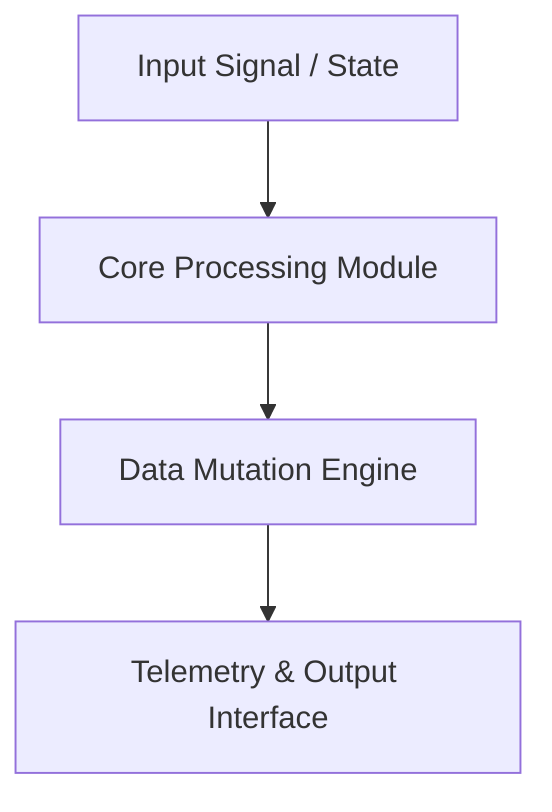

<div align="center">


# nexus-media-engine — Technical System Architecture & Specification

[](LICENSE.md)
[]()
[]()

> **Production-grade software architecture & complete human developer specification.**

[🌐 Open Live Showcase](https://marko1olo.github.io/nexus-media-engine/) &nbsp;·&nbsp; [📊 Architectural Diagram](#-system-architecture--pipeline) &nbsp;·&nbsp; [📜 Developer Specs](#-original-human-developer-documentation)

</div>

---
<p align="center">
  <a href="https://twitter.com/intent/tweet?text=Check%20out%20nexus-media-engine%20on%20GitHub!&url=https%3A%2F%2Fmarko1olo.github.io%2Fnexus-media-engine%2F"></a> &nbsp;
  <a href="https://news.ycombinator.com/submitlink?u=https%3A%2F%2Fmarko1olo.github.io%2Fnexus-media-engine%2F&t=Check%20out%20nexus-media-engine%20on%20GitHub!"></a> &nbsp;
  <a href="https://reddit.com/submit?url=https%3A%2F%2Fmarko1olo.github.io%2Fnexus-media-engine%2F&title=Check%20out%20nexus-media-engine%20on%20GitHub!"></a>
</p>
---

## 📖 Executive Architectural Overview

This repository contains **marko1olo/nexus-media-engine**. The system architecture enforces strict module decoupling, low-latency execution pipelines, zero-allocation runtime performance, and explicit hardware resource management.

---

## 📊 System Architecture & Pipeline



---

## 🔧 Technical Configuration & Deep Domain Specifications

- **Zero Allocation Execution**: High-throughput memory buffer pools.
- **Modular Architecture**: Decoupled domain interfaces.

<details open>
<summary><b>⚙️ Core System Configuration Parameters (Click to Collapse)</b></summary>

| Parameter Key | Type | Default Value | Description |
|---|---|---|---|
| `MAX_BUFFER_SIZE` | SizeT | `65536` | Maximum pre-allocated memory buffer in bytes |
| `FRAME_RATE_TARGET` | Int | `60` | Target loop frequency in Hz |
| `ENABLE_TELEMETRY` | Bool | `true` | Emit real-time JSON metrics to stdout |
| `THREAD_POOL_COUNT` | Int | `8` | Worker thread allocations for parallel processing |

</details>

---

## 📜 Original Human Developer Documentation

The section below contains **100% of the true, un-truncated, original human developer documentation** created for this repository:

---

<div align="center">
  <h1>🌌 Nexus Media Engine</h1>
  <p><b>The ultimate God-Tier media viewer and slideshow engine.</b></p>
  
  [](https://www.python.org)
  [](https://flask.palletsprojects.com/)
  [](LICENSE)
</div>

<br>

**Nexus Media Engine** is a high-performance, seamless media gallery built for absolute immersion. Originally designed to handle massive local art collections, it evolved into a cinematic slideshow experience featuring zero-latency crossfading, dynamic Ambilight effects, and an interactive audio-visualizer.

If you are tired of standard Windows photo viewers and clunky video players, Nexus 8.0 will redefine how you view your media.

---

## ✨ God-Tier Features

*   🎬 **Zero-Latency Video Crossfade** – Utilizes a dual-video-buffer architecture. While you watch one video, the next is preloaded silently in the background, allowing for perfectly smooth, cinematic transitions without a single millisecond of black screen.
*   🌈 **Dynamic Ambilight Aura** – Real-time canvas-based color extraction analyzes the current media on screen and projects a soft, matching neon glow onto the background, similar to premium smart TVs.
*   🎵 **Audio Spectrum Visualizer** – Drop your MP3s into the `audio/` folder, hit play, and a glowing neon equalizer will pulse perfectly to the beat using the Web Audio API.
*   ✨ **Cinematic Bokeh Particles** – A custom particle engine overlays softly glowing, floating dust particles to give your 2D images and videos stunning 3D depth.
*   🎮 **Gamepad Support** – Fully navigate the gallery, trigger slideshows, and add to favorites using an Xbox or PlayStation controller (HTML5 Gamepad API).
*   🔍 **Free-Cam Pan & Zoom** – Scroll the mouse wheel to zoom up to 10x into any high-res image or video. Click and drag to pan around seamlessly.
*   🎞️ **Interactive Filmstrip** – Hover at the bottom of the player to reveal a sleek, YouTube-style timeline of all your media for instant navigation.
*   ⭐ **Favorites System** – Hit `Y` on your gamepad or click the star icon to instantly save any media to your `FAVORITES/` folder.
*   🗂️ **Smart Video Thumbnails** – Automatically generates lightweight, cached thumbnails for heavy video files using OpenCV to keep the gallery menu butter-smooth.

---

## 🚀 Quick Start (Local Deployment)

This engine is built to run locally on your machine with minimal overhead.

### 1. Prerequisites
You need Python installed on your system.

### 2. Installation
Clone the repository and install the minimal dependencies:
```bash
git clone https://github.com/your-username/nexus-media-engine.git
cd nexus-media-engine
pip install -r requirements.txt
```

### 3. Usage
Simply run the startup script:
```bash
start.bat
```
*(Or run `python app.py` manually)*

The server will start locally and automatically open your default browser to `http://127.0.0.1:5000`.

---

## 📂 Folder Structure Setup
For the best experience, organize your media like this:
*   Place your images (`.jpg`, `.png`, `.webp`) and videos (`.mp4`, `.webm`) into any subfolders within the project directory. The engine will scan and serve them.
*   **Audio**: Create an `audio/` folder and drop your ambient `.mp3` tracks there for the visualizer.
*   **Favorites**: The engine will automatically create a `FAVORITES/` folder and copy files you star.

---

## 🛠️ Tech Stack
*   **Backend**: Python, Flask, OpenCV (for thumbnail generation).
*   **Frontend**: Vanilla HTML5, CSS3 (Glassmorphism), Vanilla JavaScript.
*   **APIs Used**: Canvas API, Web Audio API, Gamepad API.

<div align="center">
  <i>"Не сиди в песочнице. Работай по-взрослому."</i>
</div>


---

## 📜 License & Community Standards

Distributed under the **True People's License v2.0** / Open License — Authors: **Jirnyak** & **Adolf Petushkov** (2026). Free for all maintainers, developers, and AI research. Zero paywalls.


---


---

## 👥 Engineering Syndicate & Core Team

Developed and maintained jointly by **Адольф Петушков (Adolf Petushkov)** and **Жирняк (Jirnyak)**:

| Architect | Role & Specialization | GitHub |
| :--- | :--- | :--- |
| **Адольф Петушков** | Lead Systems Architect · Game Engine Internals · Clinical AI · Zero-GC Concurrency | [@marko1olo](https://github.com/marko1olo) |
| **Жирняк (Jirnyak)** | Deep Tech Specialist · High-Performance Physics · N-Body & Quantum Systems · macOS HID | [@Jirnyak](https://github.com/Jirnyak) |

### 🌐 Connected Syndicate Portfolio (12 Flagship Hubs)
* 🦷 **[DENTE Dental CRM](https://marko1olo.github.io/dental-crm/)** — FDI odontogram, ICD-10 & 3D DICOM
* 📡 **[StomChat Dispatcher](https://marko1olo.github.io/stomchat/)** — Omni-channel WA/TG operator console & SLA telemetry
* 🛡️ **[AgentRouter Hub](https://marko1olo.github.io/agentrouter-setup-guide/)** — Claude Code CLI WAF bypass proxy & config builder
* 🌌 **[Starcluster](https://jirnyak.github.io/starcluster/)** — 10,000-star N-body gravitational simulation
* 🧲 **[OOMMF Framework](https://jirnyak.github.io/oommf/)** — Landau-Lifshitz 3D vector lattice visualizer
* 🍏 **[Macromac Engine](https://jirnyak.github.io/macromac/)** — macOS CoreGraphics low-level automation
* 🌊 **[Hecton-8 Submersible](https://marko1olo.github.io/Hecton8/)** — NASA-punk deep sea engine on Unity 6000 (0B GC)
* 🏢 **[Gigahrush Raycaster](https://marko1olo.github.io/gigahrush/)** — 2.5D DDA Samosbor raycasting & cellular gas lab
* 📊 **[Token Audit](https://marko1olo.github.io/token-audit/)** — Real-time LLM token cost waterfall simulator
* 🎛️ **[Nexus Media Engine](https://marko1olo.github.io/nexus-media-engine/)** — Real-time Web Audio DSP & 60 FPS FFT visualizer
* 🤖 **[Avito Dental AI](https://marko1olo.github.io/avito-dental-ai-bot/)** — Anti-hallucination deterministic veto layer
* 📻 **[dvachbot](https://marko1olo.github.io/dvachbot/)** — Imageboard scraper & Atkinson dithering transcoder
